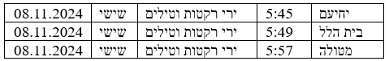
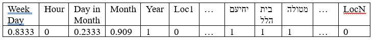
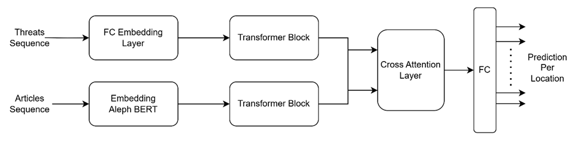
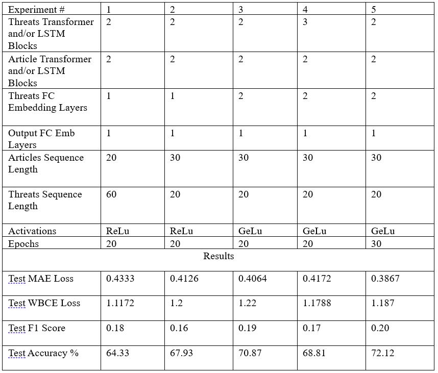

# Predicting The Next Rocket Alert

This project's goal is to create and train a model that predicts the next rocket threat alert on the state of Israel.

## Table of Contents
- [Datasets](#datasets)
- [Model Architecture](#model-architecture)
- [Results](#results)
- [Setup](#setup)
- [Usage](#usage)
- [Future Work](#future-work)
- [Appendix](#appendix)

## Datasets
### Alerts Dataset
The **Threats Dataset** provides the primary temporal input for the model, capturing patterns of rocket alerts across various cities in Israel. The dataset is sourced from publicly available Home Front Command (Pikud Ha'oref) data.

#### Structure
Each entry in the raw dataset includes:
- **Date**: The day the alert occurred.
- **Time**: The specific time of the alert.
- **Day of the Week**: The weekday of the alert.
- **Type of Alert**: Nature of the event (e.g., rocket or missile fire).
- **Location**: City or area affected.

**Example (Raw):**


#### Preprocessing
1. **Timestamp Binning**: Alerts are grouped into 6-hour intervals, creating a single timestamp for combined alerts.
2. **Normalization**: Time-related features are scaled using Min-Max normalization (e.g., hour 12:00 → 0.6667).
3. **Multi-Hot Encoding**: A binary vector represents affected locations in each time interval.
4. **Sequence Generation**: Sequential samples are combined into fixed-length sequences for model input.

**Example (Processed):**



### Articles Dataset
The **Articles Dataset** provides contextual information by embedding war-related news articles. These embeddings enrich the model’s temporal predictions with insights from real-world events.

#### Structure
Each entry in the raw dataset includes:
- **Date**: Publication date of the article.
- **Time**: Time the article was posted.
- **Title**: Headline of the article.
- **Summary**: A brief description of the article content.

**Example (Raw):**

#### Preprocessing
1. **Normalization**: Time-related features are Min-Max normalized similarly to the threats dataset.
2. **Embedding Generation**: Titles and summaries are passed through AlephBERT, producing a 1536-dimensional embedding.
   - 728 dimensions for the title.
   - 728 dimensions for the summary.
3. **Sequence Synchronization**: Articles are aligned with threat sequences to ensure temporal coherence.

The processed result is a vector with the same 5 time elements as the alerts dataset,
concatenated with the embeddings of both the titles and summaries (1541 elements in total)


### Labels
The labels for the dataset are derived directly from the threats dataset.
Since we saved all the alert information within the dataset, we inherently have the labels for each defined sequence.
Specifically, the label for each sequence corresponds to the next sample in the dataset,
which holds information about alerts occurring immediately after the current sequence (i.e., within the next 6-hour day quarter).
This approach is a key factor in making the project feasible,
as it allows for simultaneous retrieval of both samples and their corresponding labels.


## Model Architecture
The model uses a **transformer-based dual-stream architecture** with a **symmetric cross-attention mechanism**. It integrates two data streams: **threat sequences** and **war-related article sequences**. Key components include:

### Embedding Layer
- Threat sequences: Fully connected layer generating embeddings.
- Article sequences: AlephBERT pre-trained model for embedding titles and summaries.

### Transformer Flows
- Separate transformers for learning temporal dependencies in threats and contextual relevance in articles.

### Cross-Attention Layer
- Combines features from the two data streams to model interactions effectively.

### Output Layer
- A fully connected layer outputs a probability vector for alerts across predefined locations.

### Loss Function
- A weighted binary cross-entropy loss balances class distribution by assigning higher weights to rare positive samples.



## Results
The experimentation we focused on in this project dealt mostly with the model's archtecture.
Constant Higher parameters during experemintation were:
batch size of 16, learning rate of 1e-3, and hidden dimension of size 512.
Below is a table of some of our experiments:

As can be seen from the table, we noticed that the parameters in test 3 yielded the most successful results.
In the final column (test 6) we took those parameters and trained for another 10 epochs. It can be seen that the results slightly improved.

Because of the sparse nature of our dataset, a good criteria to determine weather the network works is the F1 score.
As can be seen, the F1 score slightly improved with training.

It was also observed that using LSTM blocks in both separate data flow blocks yielded
better results than using transformers.

Altogether, and although the final accuracy results seem decent,
the fact that the data is ultimately very sparse may mislead to the notion
that the model performs the task at hand properly – and this is not the case.
We found that we could train the model to not output degenerate values, and in some
instances even predict properly and notice some real statistical features in the data
(like for example the fact that cities that are close geographically are more likely to have
threat alerts together), but in general the comparingly high precision can be attributed to the
fact that the model has an easier time scoring correctly on ‘0’ classifications in this very sparse setting.


## Setup
Follow the steps below to set up the project on a Windows system using Python.
### Prerequisites
Before starting, ensure the following are installed:
- Python 3.7 or later (download from [python.org](https://www.python.org/))
- pip (comes with Python installation)
- [Git](https://git-scm.com/)
### Installation
 Open Command Prompt or PowerShell and do the following:
1. **Clone the repository:**
     ```cmd
     git clone https://github.com/username/repository.git
     cd repository
     ```
2. **Create a virtual environment:**
     ```cmd
     python -m venv venv
     venv\Scripts\activate
     ```
 3. **Install Requirements**
    ```cmd
    pip install -r requirements.txt
    ```

## Usage
  1. **Train the model:**
      You may change parameters in the main script.<br>
      In particular, if you want to re-generate embeddings for the articles, set:
      ```python
      read_embedded_articles = False
      ```
      Otherwise, embeddings will be read from an already embedded .csv file (for faster performance)
    
      Next, run main from Command Prompt or PowerShell:
      ```cmd
      python main.py
      ```
      Running the main script both trains and tests the model using the data in the "data" directory.<br>
      The trained model and additional train information are saved under the 'results' directory.

  2. **Predict using the trained model:**
      First, make sure you have:<br>
      1. Environment setup as described above
      2. Trained model
      3. parameters in main_eval.py match the parameters used to train the model
      4. Alerts dataset (.csv) in the same format as described here.
      5. Articles dataset (.txt) in the same format as described here.
      Use main_eval.py under evaluate directory.

     ```cmd
     python evaluate/main_eval.py --param1 'trained model.pth' --param2 'alerts path.csv' --param3 'articles directory'
     ```
  
   

## Future Work
      


## Appendix
### Data Format
The data we used to train and test the model is not present in this github repository.<br>
If you are interested in working with our dataset, please contact us via email:<br>
alon.zuaretz@campus.technion.ac.il<br>
or<br>
tomer.benish@campus.technion.ac.il
#### Articles data format:
**Three separate .txt files:**
1.
    Date_time.txt structured as follows::<br>
    Sample number: 1<br>
    30.09.24 | 12:04<br>
    Sample number: 2<br>
    30.09.24 | 08:47<br>
    etc...<br>
2. 
    Main_titles.txt structured as follows::<br>
    Sample number: 1<br>
    "hebrew text"<br>
    Sample number: 2<br>
    "hebrew text"<br>
    etc...
3. Sub_titles.txt structured as follows::<br>
    Sample number: 1<br>
    "hebrew text"<br>
    Sample number: 2<br>
    "hebrew text"<br>
    etc...

#### Alerts data format:
**One .csv file with the following columns:**
1. date
2. week day
3. type
4. hour
5. location
     

## Reference:

[1] Seker, Bandel, Bareket, Brusilovsky, Greenfeld, Tsarfaty. “AlephBERT: A Hebrew Large Pre-Trained Language Model to Start-off your Hebrew NLP Application With” arXiv preprint arXiv:2104.04052 (2021).
